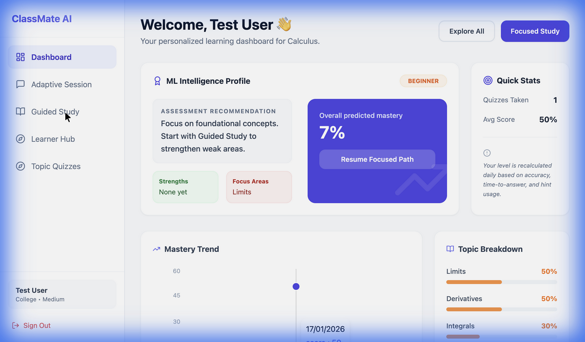
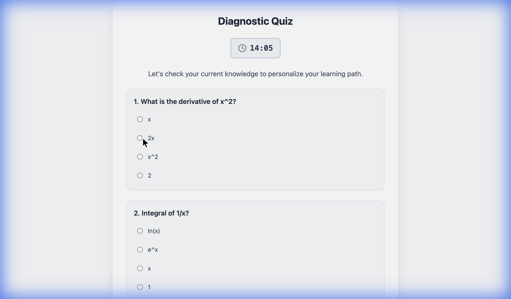
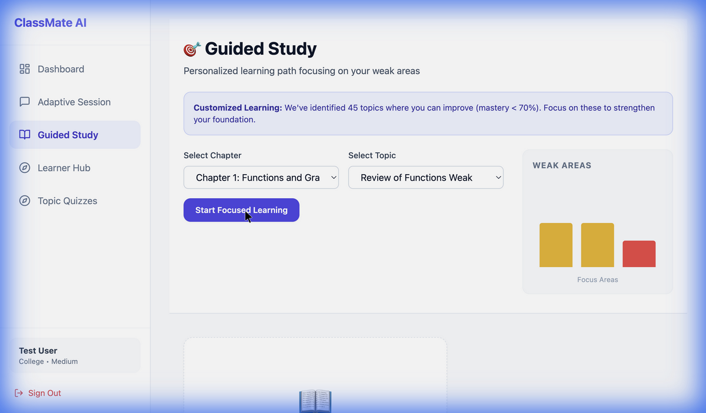
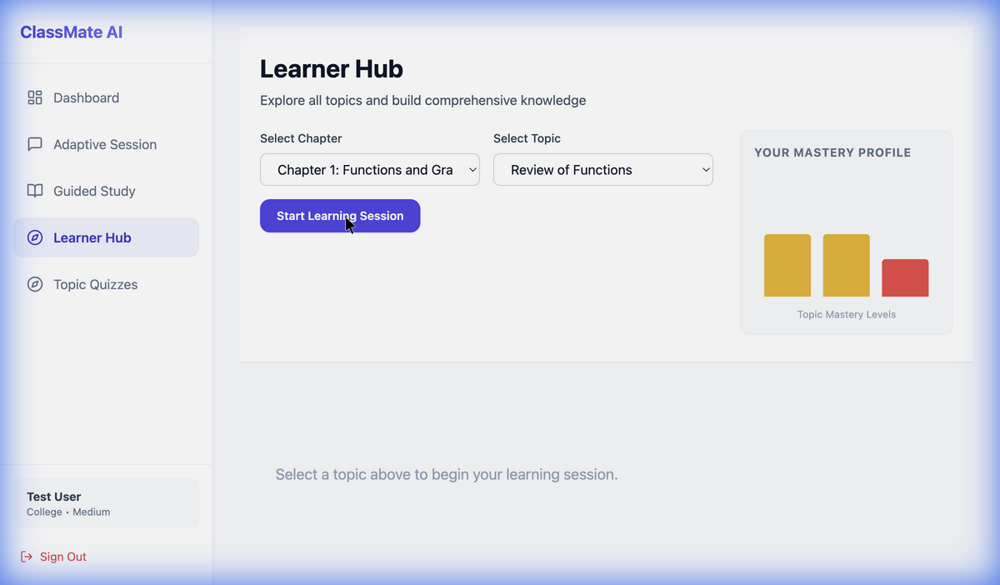
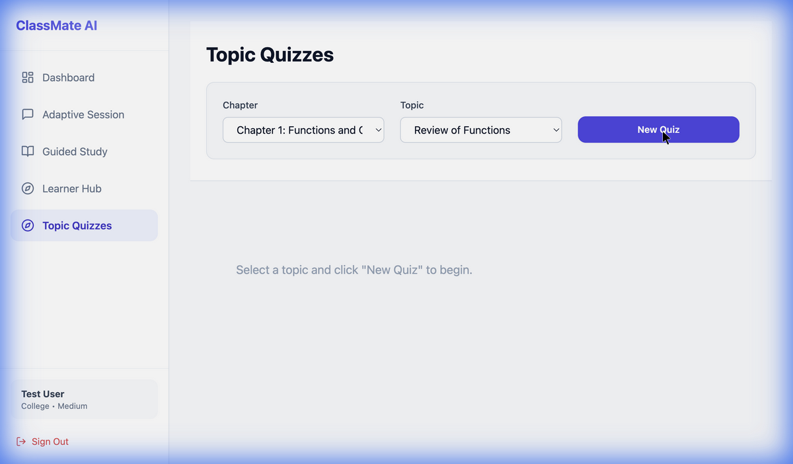
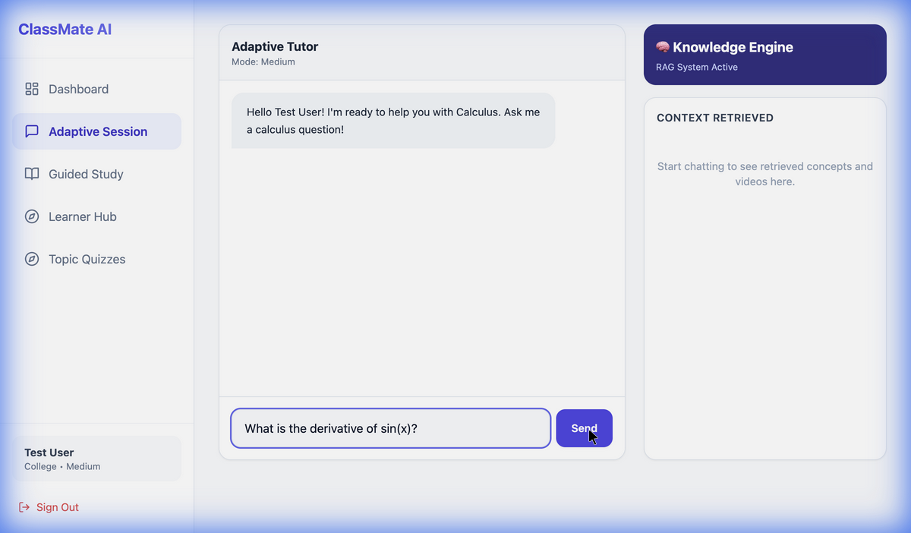

# ClassMate AI - Intelligent Adaptive Calculus Tutor 🎓

ClassMate AI is a cutting-edge, adaptive learning platform designed to master Calculus through personalized, AI-driven guidance. It combines the power of **Retrieval-Augmented Generation (RAG)** with a custom **Machine Learning assessment model** to provide a learning experience that rivals a human tutor.



---

## ⚡️ Why RAG? (Retrieval-Augmented Generation)

We chose a RAG architecture for this project to solve several critical challenges in AI-based education:

1.  **Eliminating Hallucinations**: Standard LLMs can confidently invent incorrect math facts. By retrieving verified content from our curated calculus knowledge base (textbooks, verified examples) and forcing the LLM to use *only* that context, we ensure accuracy.
2.  **Cost-Effective Scalability**: Instead of using massive, expensive models (like GPT-4) for every query, RAG allows us to use lightweight local models (like Llama 3 via Ollama). The "intelligence" comes from the retrieval of high-quality context, meaning we get expert-level answers at zero API cost.
3.  **Context-Aware Customization**: The system doesn't just "generate" a generic answer. It wraps the specific context we provide (e.g., a specific integration technique) into a student-friendly explanation, allowing us to deeply customize the pedagogy without retraining the model.

---

## 🤖 The ML Engine: Guided Learning

Beyond just generating content, ClassMate AI "knows" you. We trained a custom Machine Learning model (`ml_engine.py`) to assess student mastery in real-time.

### How it Works:
*   **Input Features**: Time taken per question, number of attempts, hints used, and question difficulty classification.
*   **Assessment**: It doesn't just look at "correct/incorrect." Answering correctly after 3 attempts and 2 hints yields a lower mastery score than answering instantly.
*   **Adaptive Profiling**: The model constantly updates your **User Level** (Beginner, Intermediate, Advanced) and identifies your **Weak Areas** dynamically.

This powers the **Guided Study** feature, which automatically filters out topics you've mastered and focuses *only* on what you need to improve.

---

## 🚀 Setup & Run Instructions

### Prerequisites
*   **Node.js** (v18+)
*   **Python** (v3.10+)
*   **Ollama** (for local LLM inference)

### 1. Start Ollama
Ensure Ollama is installed and running with the Llama 3 model:
```bash
ollama pull llama3.1:8b
ollama serve
```

### 2. Backend Setup (FastAPI)
The backend handles RAG retrieval, ML inference, and LLM orchestration.

```bash
cd backend
python -m venv .venv
source .venv/bin/activate  # Windows: .venv\Scripts\activate
pip install -r requirements.txt

# Start the server
python server.py
```
*Server runs on `http://localhost:8000`*

### 3. Frontend Setup (React/Vite)
The frontend provides the interactive learning experience.

```bash
# In the project root (new terminal)
npm install
npm run dev
```
*App runs on `http://localhost:5173`*

---

## 📚 Feature Walkthrough

### 1. Smart Onboarding & Diagnostic
When you first join, ClassMate AI doesn't guess your level. You take a comprehensive **15-question Diagnostic Quiz** covering Limits, Derivatives, Integrals, and more. This establishes your initial baseline.

| Onboarding | Diagnostic Quiz |
|------------|-----------------|
|  |  |

### 2. Intelligence Dashboard
Your command center. The **ML Intelligence Profile** visualizes your current level, calculates an overall mastery score, and provides actionable, daily recommendations.


### 3. Dual Learning Paths

#### **Path A: Guided Study (Focused)**
For targeted improvement. This view **dynamically filters** the syllabus to show *only* your weak areas (Mastery < 70%). If you master a topic here, it graduates off this list!


#### **Path B: Learner Hub (Comprehensive)**
For broad exploration. Access the entire library of topics, videos, and quizzes regardless of your mastery score.


### 4. Adaptive Quizzes
Practice makes perfect. Our quizzes feature:
*   **15-Minute Timer**: Simulates exam conditions.
*   **Smart Hints**: Request a hint to get RAG-powered help (tracks usage for ML grading).
*   **RAG Transparency**: See exactly which source materials generated the questions.



### 5. AI Tutor & Adaptive Session
Stuck on a concept? Chat with the **AI Tutor**. It uses RAG to pull specific textbook definitions and examples to answer your questions accurately, citing its sources in the sidebar.



---

## 🛠 Tech Stack
*   **Frontend**: React, TypeScript, Tailwind CSS, Recharts, Framer Motion
*   **Backend**: FastAPI, Uvicorn, Python
*   **AI/ML**: Ollama (Llama 3), FAISS (Vector DB), Scikit-Learn (Mastery Model), Sentence-Transformers
