# ClassMate AI - Intelligent Adaptive Calculus Tutor 🎓

ClassMate AI is a cutting-edge, adaptive learning platform designed to master Calculus through personalized, AI-driven guidance. It combines the power of **Retrieval-Augmented Generation (RAG)** with a custom **Machine Learning assessment model** to provide a learning experience that rivals a human tutor.

## 📚 Project Documentation

- **[📊 Project Slides](https://docs.google.com/presentation/d/1hYsqHuxqsGqi5RAg8UD8QO2fDmYGLj6kbmmedna3r_Q/edit?usp=sharing)** - Project overview and architecture presentation
- **[📄 Technical Documentation](https://docs.google.com/document/d/1le9gwoqlOA6ssVS2QGZFVEPIGVp4ldRpBscCN6Vndi8/edit?usp=sharing)** - Detailed technical documentation


---

## ⚡️ Why RAG? (Retrieval-Augmented Generation)

We chose a RAG architecture for this project to solve several critical challenges in AI-based education:

1.  **Eliminating Hallucinations**: Standard LLMs can confidently invent incorrect math facts. By retrieving verified content from our curated calculus knowledge base (textbooks, verified examples) and forcing the LLM to use *only* that context, we ensure accuracy.
2.  **Cost-Effective Scalability**: Instead of using massive, expensive models (like GPT-4) for every query, RAG allows us to use lightweight local models (like Llama 3 via Ollama). The "intelligence" comes from the retrieval of high-quality context, meaning we get expert-level answers at zero API cost.
3.  **Context-Aware Customization**: The system doesn't just "generate" a generic answer. It wraps the specific context we provide (e.g., a specific integration technique) into a student-friendly explanation, allowing us to deeply customize the pedagogy without retraining the model.

---

## 🧠 Modular Architecture: Separation of Concerns

The design of ClassMate AI is driven by the principle that **content generation, decision-making, and learner modeling should be clearly separated**. Instead of relying on a single monolithic AI model, we employ a **modular architecture** with two specialized, independent subsystems:

### Why Modular?

1. **Scalability**: Each component can be optimized, replaced, or scaled independently
2. **Maintainability**: Changes to content generation don't affect learner assessment
3. **Transparency**: Clear boundaries make the system auditable and debuggable
4. **Cost-Efficiency**: Use expensive models only where needed (e.g., local LLM for RAG, lightweight ML for assessment)

---

## 📚 RAG Pipeline (Content Generation)

The RAG subsystem is responsible for **generating accurate, contextual educational content** by grounding the LLM in a curated knowledge base.

```mermaid
graph TB
    UserQuery[� User Request<br/>Chapter/Quiz/Question] --> RAG_Search[� Vector Search]
    
    subgraph "RAG Content Generation Pipeline"
        RAG_Search -- "Embed Query" --> Encoder[SentenceTransformer<br/>Encoder]
        Encoder -- "Query Vector" --> FAISS[(� FAISS Vector DB<br/>800+ Calculus Entries)]
        FAISS -- "Top-K Retrieval" --> Context[📄 Retrieved Context<br/>Definitions, Examples, Proofs]
        
        Context --> Prompt[🎯 Prompt Engineering<br/>System + Context + Task]
        Prompt --> LLM[� Ollama Llama 3<br/>Local Inference]
        
        LLM -- "Generated Content" --> Response[✅ Final Output<br/>Chapter/Quiz/Hint]
    end
    
    Response --> Cache[💾 Quiz Cache<br/>Optional]
    Response --> User[👤 Student]
    
    style RAG_Search fill:#e3f2fd
    style FAISS fill:#fff3e0
    style LLM fill:#f3e5f5
    style Response fill:#e8f5e9
```



**Key Characteristics:**
- **Stateless**: No student-specific data needed
- **Reusable**: Same content can serve multiple students
- **Cacheable**: Quiz/chapter outputs are cached for instant re-use
- **Grounded**: LLM output is constrained by retrieved context

---

## 🤖 ML Assessment Engine (Learner Modeling)

The ML subsystem is a **trained predictive model** that builds a personalized mastery profile for each student based on their quiz interactions.

```mermaid
graph TB
    QuizAttempt[📊 Quiz Interaction Data<br/>Time, Attempts, Hints, Correctness] --> FeatureEng[⚙️ Feature Engineering]
    
    subgraph "ML Learner Assessment Pipeline"
        FeatureEng -- "15 Features" --> Features[� Computed Features<br/>• Efficiency Score<br/>• Struggle Index<br/>• Historical Performance<br/>• Time per Attempt]
        
        Features --> MLModel[🧠 Random Forest Regressor<br/>Trained on 5000+ Samples]
        
        MLModel -- "Mastery Score 0-1" --> MasteryUpdate[🎯 Update User Profile]
        
        MasteryUpdate --> Profile[(👤 User Profile<br/>Topic Mastery Map)]
        
        Profile --> Filter[🔍 Filter Logic<br/>Mastery < 70%]
        Filter --> WeakTopics[📌 Weak Topics List]
    end
    
    WeakTopics --> GuidedStudy[🎯 Guided Study Page]
    Profile --> Dashboard[📊 Dashboard Insights]
    
    style QuizAttempt fill:#e3f2fd
    style MLModel fill:#fce4ec
    style Profile fill:#fff3e0
    style WeakTopics fill:#ffebee
```



**Key Characteristics:**
- **Stateful**: Maintains per-student mastery profiles
- **Predictive**: Infers mastery from behavior, not just correctness
- **Adaptive**: Dynamically updates as student improves
- **Personalized**: Each student has a unique profile

---

## 🔗 Integration: How They Work Together

While **independent**, the RAG and ML subsystems are **orchestrated** by the FastAPI backend:

```mermaid
graph LR
    Student([👤 Student]) --> Frontend[� React UI]
    
    Frontend <--> API[🚀 FastAPI<br/>Orchestrator]
    
    API -- "Request Content" --> RAG[📚 RAG Pipeline]
    API -- "Submit Quiz" --> ML[🤖 ML Engine]
    
    RAG -- "Return Content" --> API
    ML -- "Return Mastery" --> API
    
    API -- "Filter by Mastery" --> RAG
    
    style API fill:#e1f5fe
    style RAG fill:#f3e5f5
    style ML fill:#fce4ec
```



**Example Flow:**
1. Student requests "Guided Study" → **ML** identifies weak topics (Mastery < 70%)
2. Frontend sends weak topic to → **RAG** generates personalized chapter
3. Student takes quiz → **RAG** generates questions, **ML** assesses performance
4. Loop continues, with ML continuously refining the student model

---

## 🤖 The ML Engine: Guided Learning

Beyond just generating content, ClassMate AI "knows" you. We trained a custom Machine Learning model (`ml_engine.py`) to assess student mastery in real-time.

### How it Works:
*   **Input Features**: Time taken per question, number of attempts, hints used, and question difficulty classification.
*   **Assessment**: It doesn't just look at "correct/incorrect." Answering correctly after 3 attempts and 2 hints yields a lower mastery score than answering instantly.
*   **Adaptive Profiling**: The model constantly updates your **User Level** (Beginner, Intermediate, Advanced) and identifies your **Weak Areas** dynamically.

This powers the **Guided Study** feature, which automatically filters out topics you've mastered and focuses *only* on what you need to improve.

---

## 🚀 Setup & Run Instructions

### Prerequisites
*   **Node.js** (v18+)
*   **Python** (v3.10+)
*   **Ollama** (for local LLM inference)

### 1. Start Ollama
Ensure Ollama is installed and running with the Llama 3 model:
```bash
ollama pull llama3.1:8b
ollama serve
```

### 2. Backend Setup (FastAPI)
The backend handles RAG retrieval, ML inference, and LLM orchestration.

```bash
cd backend
python -m venv .venv
source .venv/bin/activate  # Windows: .venv\Scripts\activate
pip install -r requirements.txt

# Train the ML Model (Required first time)
python train_model.py

# Start the server
python server.py
```
*Server runs on `http://localhost:8000`*

### 3. Frontend Setup (React/Vite)
The frontend provides the interactive learning experience.

```bash
# In the project root (new terminal)
npm install
npm run dev
```
*App runs on `http://localhost:5173`*

---

## 📚 Feature Walkthrough

### 1. Smart Onboarding & Diagnostic
When you first join, ClassMate AI doesn't guess your level. You take a comprehensive **15-question Diagnostic Quiz** covering Limits, Derivatives, Integrals, and more. This establishes your initial baseline.

| Onboarding | Diagnostic Quiz |
|------------|-----------------|
|  |  |

### 2. Intelligence Dashboard
Your command center. The **ML Intelligence Profile** visualizes your current level, calculates an overall mastery score, and provides actionable, daily recommendations.


### 3. Dual Learning Paths

#### **Path A: Guided Study (Focused)**
For targeted improvement. This view **dynamically filters** the syllabus to show *only* your weak areas (Mastery < 70%). If you master a topic here, it graduates off this list!


#### **Path B: Learner Hub (Comprehensive)**
For broad exploration. Access the entire library of topics, videos, and quizzes regardless of your mastery score.


### 4. Adaptive Quizzes
Practice makes perfect. Our quizzes feature:
*   **15-Minute Timer**: Simulates exam conditions.
*   **Smart Hints**: Request a hint to get RAG-powered help (tracks usage for ML grading).
*   **RAG Transparency**: See exactly which source materials generated the questions.


### 5. AI Tutor & Adaptive Session
Stuck on a concept? Chat with the **AI Tutor**. It uses RAG to pull specific textbook definitions and examples to answer your questions accurately, citing its sources in the sidebar.


---

## 🛠 Tech Stack
*   **Frontend**: React, TypeScript, Tailwind CSS, Recharts, Framer Motion
*   **Backend**: FastAPI, Uvicorn, Python
*   **AI/ML**: Ollama (Llama 3), FAISS (Vector DB), Scikit-Learn (Mastery Model), Sentence-Transformers
